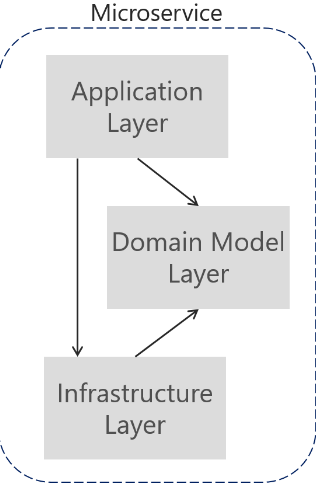

# SearchEngine

A simple search engine implementation in Scala

## Hexagonal

It helps to decouple the different layers of your service(Application, Domain, Infrastructure) making it more extensible and easy to port each of the layers into another program if it's needed.

In Search engine I implemented three modules described like:

* ```Application```: Layer which normally is the entry point of your app. It has dependency with domain and infrastructure modules.
* ```Domain```: Layer where you implement normally the business logic of your application. It does not have any dependency.
* ```Infrastructure```: Layer where you implement the communication with the backends (Database in memory). It has dependency with domain.



## Build

Using the plugin ```sbt-assembly``` we're able to cover the testing and also the creation of Jar of each module.

You just have to open a sbt shell and type

````
assembly
````

Then it will generate into the target folder of each module in the ````scala-2.12```` the jar file with name

````
${module-name}-assembly-0.1.0-SNAPSHOT.jar

````
## Run

To run the application we need two things, first we need some files to be loaded as the data, and the jar of the application.

You can use the files we have in the infrastructure for the testing, or pass your own files. But remember to do that 
as the first argument of the program.

To run the jar of ```application``` module that contains the dependencies with ```domain``` and ```infrastructure```
we go to the path ````${project-path}/application/target/scala-2.12/```` and run the command:

````
java -jar application-assembly-0.1.0-SNAPSHOT.jar
${project-path}/infrastructure/src/test/resources/files/
`````


